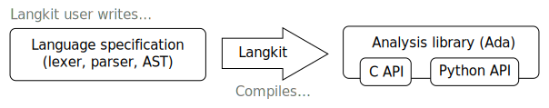

************
Introduction
************

Langkit is a tool whose purpose is to ease the development of libraries to
analyze program source files.  It makes it super-easy to create combined
lexers, parsers and semantic analyzers as libraries that have C, Ada and
Python bindings.

Architecture
============

Langkit is a kind of compiler:

* Its users are expected to write a language specification in the Lkt language,
  a domain-specific language created for the Langkit project. Lkt sources
  define a lexer, a grammar, define nodes/fields for the parse tree and
  optionally use a functional language to implement semantic analysis.

* Langkit compiles this specification into an analysis library in Ada with C
  and Python bindings.

* The generated library can be shipped to programmers that intend to write
  analysis tools such as code editors, code checkers, etc. These will not be
  aware of Langkit at all, except for common runtime libraries
  (``Langkit_Support`` in Ada, for instance).

